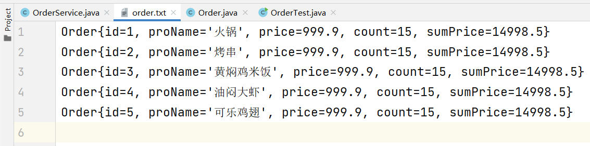

# 复习：

# LinkedList类

```java
//增
//在集合的头部插入元素
public void addFirst(E e);

//在集合尾部插入元素
public void addLast(E e);

//删
//移除头部元素
public E removeFirst();

//移除尾部元素
public E removeLast();

//查
//获取头部元素
public E getFirst();

//获取尾部元素
public E getLast();
```

# HashSet类API

```java
//实例化对象
public HashSet();

//增
public boolean add(E e);

//删
//移除指定的元素
public boolean remove(E e);

//清空集合中的元素，但是保留集合结构
public void clear();

//查
public int size();

//判
public boolean contains(E e);
```

# HashMap类API

```java
//实例化对象
public HashMap();

//将指定的一组键值对添加到Map集合中
//当KEY第一次存储时，返回值为null
//当Key再次存储时，返回KEY的原有值，并使用新的值进行覆盖
public V put(K key,V value);

//删除
//根据指定的KEY移除（如果Key存在）
public V remove(K key);

//当且仅当KEY和VALUE是键值对时，移除
public boolean remove(K key,V value);

//清空集合中的所有元素，保留集合结构
public void clear();

//改
//使用指定的VLAUE替换指定KEY的原有值（如果Key存在）
public V replace(K key,V newvalue);

//当且仅当KEY 和 VALUE是键值对关系时，使用新的VALUE替换原有值
public boolean replace(K key,V oldValue,V newValue);

//查
//获取Map集合中的键值对的个数
public int size();

// 根据指定的KEY 获取VALUE（如果KEY存在）
public V get(K key);

// 获取所有KEY所在Set集合
public Set<K> keySet();

// 获取所有VALUE所在的Collection集合
public Collection<V> values();

// 判
// 判断指定的KEY是否存在于集合中
public boolean containsKey(K key);

// 判断指定的VALUE是否存在于集合中
public boolean containsValue(V value);
```

# File类

## 实例化File类对象，并指定操作的路径，但是不能在路径下创建文件

```java
public File(String pathName);
```

## 路径

### ①绝对路径：带有盘符；方便用户获取，容易出现盘符不存在异常

### ②相对路径：没有盘符；避免盘符不存在问题，获取麻烦；实际开发中推荐使用，会将文件创建在当前项目所在的文件夹下


# 面试题：

# 简述Java中数据存储的方式有哪些？特点是什么？底层如何实现？

### ①队列式存储：先进先出，底层依赖LinkList类，addFirst方法存数据，removeLast取数据

### ②堆栈式存储：先进后出，底层依赖LinkedList类，addFirst方法存储据，removeFirst取数据

# 简述Java中集合框架结构的分类？并说明不同集合的存储特点，以及底层具体实现类是如何实现？

### ①分为：单列集合 和 双列集合

### ②存储数据特点：

### 单列集合：

### 	Collection根接口：又重复，又唯一；又有序，又无序

### 	List接口：有序不唯一

### 	Set接口：无序且唯一

### 	Queue接口：先进先出

### 双列集合：

### 	以KEY-VALUE键值对形式存储,是一一对应的映射关系

### 	其中KEY不能重复，对应的单列集合为Set；

### 	VALUE可以重复，对应的单列集合为Collection;

### ③ 具体实现类底层实现原理

### 		ArrayList类：基于动态数据存储，初始容量为10，支持自动扩容，按照1.5倍扩容

### 		LinkedList类：基于双向链表存储

### 		HashSet类：基于哈希码值存储

### 		TreeSet类：基于二叉树存储

### 		HashMap类：基于哈希码值存储

### 		TreeMap类：基于二叉树存储

# ==============================

# 今日笔记

# IO流概述

## 	将指定的数据通过IO流技术存储到文件中或从文件中获取


# 数据的操作方向

## 1、存：将数据存储到文件中 => input ，并且结合流（Stream）操作 ;      InputStream  (System.in)

## 2、取：将数据从指定的文件按中获取 => output , 并且结合流（Stream）操作 ;    OutputStream  (System.out)


# 分类

## 1、数据的流向：输入流和输出流

## 2、数据的类型：

### 字符流 => 流资源 操作 字符数据*（常用）*

### 字节流 => 流资源 操作 字节数据


# 详细分类

## 四大基流（抽象类），八大子流


# ①字符输入流

## 1、基流：Reader类

## 2、子类：FileReader类/BufferedReader类（缓冲或缓存技术）

# ②字符输出流

## 1、基流：Writer类

## 2、子类：FileWriter类/BufferedWriter类（缓冲或缓存技术）

# ③字节输入流

## 1、基流：InputStream类

## 2、子类：FileInputStream类/BufferedInputStream类（缓冲或缓存技术）

# ④字节输出流

## 1、基流：OutputStream类

## 2、子类：FileOutputStream类/BufferedOutputStream类（缓冲或缓存技术）


# 流资源类名定义规范

## 1、前缀：当前类操作文件的位置

## 2、后缀：当前类对文件进行什么操作，并且表示操作文件的数据类型


# IO流记忆法

## 输入流：Reader、InputStream

## 输出流：Writer、OutputStream


# 字符流API（重点）

## FileWriter类Api

```java
package cn.wolfcode.filewriter.test;

import java.io.FileWriter;
import java.io.IOException;

public class FileWriterApiTest {
    public static void main(String[] args) {
        FileWriter fw = null;//局部变量=null
        /*
         * 实例化FileWriter类对象，并指定操作文件的路径
         * public FileWriter (String filePath);
         *
         * 拓展：
         *      1、流资源对象通过构造器实例化，会直接在指定的路径下创建文件
         *      2、当文件不存在时，创建：当文件存在时，创建并覆盖原有文件
         * */
        try {
            fw = new FileWriter("fw.txt");
            // 创建一个FileWriter对象，指定输出文件名为"output.txt"
            /*
             * 一组写的方法
             * public Writer append(char c);
             * 在流对象结尾处追加一个元素
             *
             * public void write(int ch);
             * 在流对象中可写字符,可写ascii值
             *
             * public void write(char[] cbuf);
             * 在流对象中写入一个字符数组
             *
             * public void write(char[] cbuf,int beginIndex,int length);
             * 从指定的字符数组的指定位置开始写入指定的长度到流对象中
             *
             * public void writer (String value)
             * 在流对象中写入一个字符串！！！！！！！！！！！！！
             *
             * public void write(Stirng value,int beginIndex,int length);
             * 从指定的字符串的指定位置开始写入指定的长度到流对象中
             *
             * 拓展：
             *   通过执行上述代码发现，没有将数据直接写入指定文件中
             *   原因:由于计算机底层是通过字节完成数据操作，由于现在作的是字符，因此是将数据
             *   写入到流对象中，需要将流对象中的数据，刷新到文件中
             * */
            fw.append('#');
            fw.write(99);
            fw.write(new char[]{'z', 'l', 'h'});
            /*
             * public void flush()
             * 将流对象中的数据刷新到指定的文件中
             * */
            fw.flush();
            fw.write(new char[]{'z', 'l', 'h'}, 0, 3);
            // 将字符数组中的前三个字符写入文件
            fw.write("大美女");
            fw.write("大美女大美女大美女", 3, 10);
            System.out.println("实例化成功！！！");
        } catch (IOException e) {
            e.printStackTrace();
        } finally {
            /*public void close();
             * 关闭之前进行最后一次刷新
             * 流资源对象必须关闭
             * 所以定义在finally
             * 所以对指定流资源对象进行合理化判断（非空判断）
             * */
            try {
                if (fw != null)
                    fw.close();
                //非空判断是为了确保文件写入器（FileWriter）对象fw不为null。
                //如果fw为null，那么调用fw.close()方法会抛出NullPointerException异常。
                //为了避免这种情况，我们在调用fw.close()之前先检查fw是否为null。
            } catch (IOException e) {
                e.printStackTrace();
            }
        }
    }
}
```

# io流步骤

```java
import java.io.*;

public class IOExample {
    public static void main(String[] args) {
        // ①声明IO流资源类对象，并赋初始值为null
        FileInputStream fis = null;
        try {
            // ②在try块中，完成流资源对象的实例化和对数据的操作
            fis = new FileInputStream("example.txt");
            int data;
            while ((data = fis.read()) != -1) {
                System.out.print((char) data);
            }
        } catch (IOException e) {
            e.printStackTrace();
        } finally {
            // ③在finally块中，关闭流资源对象，在关闭前，需要对指定的流资源对象进行非空判断
            if (fis != null) {
                try {
                    fis.close();
                } catch (IOException e) {
                    e.printStackTrace();
                }
            }
        }
    }
}
```


# 实现文件中换行显示


```java
			 /*
             * 文件中换行操作
             *   java换行：1、System.out.println(); 2、换行转移字符：\n
             *   文件换行：需要操作系统读取到换行指令才能完成
             *            1、Windows操作系统 \r\n
             *            2、Linux系统 \n
             * 上述操作,java代码一直到Linux操作系统上，会出问题，违背了Java语言的跨平台性
             * */
```


# BufferedWriter类API

### 将FileWriter类在堆栈内存操作文件的动作，转移缓冲区中操作，一定程度上降低堆栈内存的损耗

### 	① 操作、刷新、关闭操作都与FileWriter类一致，详情参考FileWriter类

### 	② 代码演示

# BufferedWriter类API

## 3-1 作用：将FileWriter类在堆栈内存操作文件的动作，转移缓冲区中操作，一定程度上降低堆栈内存的损耗

## 3-2 API

### 	①写的操作、刷新、关闭操作都与FileWriter类一致，详情参考FileWriter类

### 	②代码演示

# BufferedWriter类API

## 3-1 作用：将FileWriter类在堆栈内存操作文件的动作，转移缓冲区中操作，一定程度上降低堆栈内存的损耗

## 3-2 API

### 	①写的操作、刷新、关闭操作都与FileWriter类一致，详情参考FileWriter类

### 	②代码演示

```java
package cn.wolfcode.filewriter.test;

import java.io.BufferedWriter;
import java.io.FileWriter;
import java.io.IOException;

public class BufferWriterApiTest {
    public static void main(String[] args) {
        BufferedWriter br = null;
        /*
        * 避免空指针异常（NullPointerException） ：如果在声明时不将其初始化为 null，而是直接尝试使用它（例如调用其方法），那么在尚未为其分配实际对象的情况下，程序会抛出空指针异常。通过将其初始化为 null，我们可以确保在使用之前已经为其分配了内存空间。
        * 
        * 明确变量状态 ：将变量初始化为 null 有助于明确地表明该变量尚未指向任何有效的对象。这有助于提高代码的可读性，使其他开发者更容易理解代码的意图。
        * 
        * 方便后续赋值 ：如果 br 是一个局部变量，并且在方法内部需要多次使用，那么将其初始化为 null 可以确保在每次使用前都进行了适当的赋值。这样可以避免因未初始化而导致的潜在问题。
        * */
        /*
         * public BufferedWriter(Writer out)
         * 实例化BufferedWriter类对象，并将指定的输出流对象转存到缓冲取中
         * 由于Writer类是抽象类，无法直接实例化对象，因此传递的具体实现类FileWriter
         * */
       try {
            //创建一个BufferedWriter对象，它包装了一个FileWriter对象，用于向名为"br.txt"的文件写入数据。如果文件不存在，将创建一个新文件。
            br = new BufferedWriter(new FileWriter("br.txt"));
            //使用BufferedWriter对象的write方法将字符串"这是字符输出流高校流"写入文件。
            br.write("这是字符输出流高校流");
            //public void newLine();
            //调用BufferedWriter对象的newLine方法，按照当前系统换行的习惯，在文件中实现换行操作。
            br.newLine();
            //刷新缓冲区，确保所有待写入的数据都被写入文件。
            br.flush();
            //再次使用write方法将字符串"张金吃屁"写入文件。
            br.write("张金吃屁");
            //如果在执行上述操作时发生IOException，将捕获异常并打印堆栈跟踪信息。
        } catch (IOException e) {
            e.printStackTrace();
        } finally {
            //最后，在finally块中关闭BufferedWriter对象，释放与之关联的资源。
            //如果关闭过程中发生IOException，同样捕获异常并打印堆栈跟踪信息。
            try {
                if (br != null) {
                    br.close();
                }
            } catch (IOException e) {
                e.printStackTrace();
            }
        }
    }
}
```


# 课堂案例

## 自定义订单类（Order类），要求包含商品序号（Long id）、商品名称（String porName）、商品单价（double privce） 、商品数量（int count） 、商品总价（double sumPrice）;存储数据，将数据写入到order.txt文件中，要求文件中每一行显示一条

### ①Order类

```java
package cn.wolfcode.domain;

public class Order {
    private Long id;
    private String proName;
    private double price;
    private int count;
    private double sumPrice;

    public Order() {
    }

    public Order(Long id, String proName, double price, int count) {
        this.id = id;
        this.proName = proName;
        this.price = price;
        this.count = count;
        this.sumPrice = this.price * this.count;
        //计算总价（单价乘以数量），并将结果赋值给类的成员变量sumPrice。
    }

    public Long getId() {
        return id;
    }

    public void setId(Long id) {
        this.id = id;
    }

    public String getProName() {
        return proName;
    }

    public void setProName(String proName) {
        this.proName = proName;
    }

    public double getPrice() {
        return price;
    }

    public void setPrice(double price) {
        this.price = price;
    }

    public int getCount() {
        return count;
    }

    public void setCount(int count) {
        this.count = count;
    }

    public double getSumPrice() {
        return sumPrice;
    }

    public void setSumPrice(double sumPrice) {
        this.sumPrice = sumPrice;
    }

    @Override
    public String toString() {
        return "Order{" +
                "id=" + id +
                ", proName='" + proName + '\'' +
                ", price=" + price +
                ", count=" + count +
                ", sumPrice=" + sumPrice +
                '}';
    }
}

```

### ②OrderService类

```java

package cn.wolfcode.service;

import cn.wolfcode.domain.Order;

import java.io.BufferedWriter;
import java.io.FileWriter;
import java.io.IOException;
import java.util.ArrayList;

public class OrderService {
    private static ArrayList<Order> orders;

    static{
        orders = new ArrayList<>();
        orders.add(new Order(1L,"火锅",999.9,15));
        orders.add(new Order(2L,"烤串",999.9,15));
        orders.add(new Order(3L,"黄焖鸡米饭",999.9,15));
        orders.add(new Order(4L,"油闷大虾",999.9,15));
        orders.add(new Order(5L,"可乐鸡翅",999.9,15));
    }
    //将指定的数据写入到指定的文件中
    public void dataWriterToFile(){
        BufferedWriter bw = null;
        try {
            bw = new BufferedWriter(new FileWriter("order.txt"));
            //遍历集合来获取每一个元素
            for(Order order:orders){
                bw.write(order.toString());
                bw.newLine();
                bw.flush();//写完一次，刷新一次
            }
        } catch (IOException e) {
            e.printStackTrace();
        }finally {
            try {
                if(bw!=null){
                    bw.close();
                }
            } catch (IOException e) {
                e.printStackTrace();
            }
        }
    }
}
```

### ③测试类

```java
package cn.wolfcode.test;

import cn.wolfcode.service.OrderService;

public class OrderTest {
    public static void main(String[] args) {
        OrderService os = new OrderService();
        os.dataWriterToFile();
    }
}

//结果是将OrderService类中的orders集合中的所有Order对象的信息写入到名为"order.txt"的文件中。每个Order对象的信息占一行，包括id、proName、price、count和sumPrice。
```




# BufferedReader类API

## 将FileReader类在堆栈内存操作的动作转移到缓冲区中完成，一封程度上降低堆栈内存的损耗


# 字节流API

## 1、FileOutputstream的API

```java
package cn.wolfcode.reader.api.test;

import java.io.FileNotFoundException;
import java.io.FileReader;
import java.io.IOException;

public class FileReaderApiTest {
    public static void main(String[] args) {
        FileReader fr = null;
        /*
         * public FileReader(String fileName)
         * 实例化FileReader类对象，并指定要读取的文件
         * */
        try {
            fr = new FileReader("order.txt");
            //它使用了FileReader类来读取名为"order.txt"的文件。
            /*
             * 一组读的方法
             *   public int read();
             *   读一个字符
             *   返回值int有两个含义
             *      ①当读取的是文件中的数据时，表示当前读到的字符的ASCII的值
             *      ②当读取的是文件结尾处时，自动返回-1
             *   public int read(char[] cbuf)
             *   将读到的字符存储到指定的字符数组中
             *
             *   public int read(char[] cbuf,int beginIndex,int length)
             *   将读到的字符存储到指定的字符数组中
             *
             *   pulic int read(char[] cbuf,int beginIndex,int length)
             *   将读到的字符从指定字符数组的指定位置开始，储存指定长度
             *
             *   当调用的时读一组的方法时，在创建字符数组时，长度java要求为1024的整数倍
             * */
            char[] cbuf = new char[1024 * 5];
            //定义读取指针的初始位置为-1
            int data = -1;
            //只要data不等于-1，则一直读取,当读取到文件末尾时，read()方法返回-1时循环结束
            while ((data = fr.read(cbuf)) != -1) {
                //将读到的元素存储到字符数组中，需要将字符数组转换成String完成数据展示
                System.out.println(new String(cbuf, 0, data));
            }
            /*
            * 如果在读取过程中发生异常，如文件未找到或IO错误，
            * 程序会捕获这些异常并打印堆栈跟踪。
            * */
        } catch (FileNotFoundException e) {
            e.printStackTrace();
        } catch (IOException e) {
            e.printStackTrace();
        } finally {
            /*
            * 在finally块中，确保FileReader对象被正确关闭。
            * */
            try {
                if (fr != null) {
                    fr.close();
                }
            } catch (IOException e) {
                e.printStackTrace();
            }
        }
    }
}
//文件读取示例
//它使用了FileReader类来读取名为"order.txt"的文件。
//代码首先创建一个FileReader对象，然后使用read()方法读取文件中的字符，并将它们存储在一个字符数组cbuf中。
//当读取到文件末尾时，read()方法返回-1，循环结束。
//最后，将字符数组转换为字符串并打印出来。
//如果在读取过程中发生异常，如文件未找到或IO错误，程序会捕获这些异常并打印堆栈跟踪。
//在finally块中，确保FileReader对象被正确关闭。
```

## 字节输出流可以直接写入到文件中，原因是字节流操作的是字节，而计算机底层也是直接使用字节进行数据操作


## 2、BufferedOutputStream类只需要记住构造器

```java
public BufferedOutputStream(OutputStream out);
```

## BufferedOutputStream类中并没有提供高效的方法，反而还需要通过flush方法将流对象中的数据刷新到文件中，原因是高效流操作的是缓冲区，而非计算机内存


## 3、FileInputStream类API

```java
public class FileInputStreamApiTest {
    public static void main(String[] args) {
        FileInputStream fis = null;
        try {
            /*
             * public FileInputStream(String fileName)
             * 实例化FileInputStream对象，并指定要读取的文件路径
             * */
            fis = new FileInputStream("Ordar");
            /*
             * 一组读的方法
             * public int read()
             * 读一个字节，当读到文件结尾处，返回-1
             *
             * public int read(byte[] bbuf)
             * 将读到的字节存储到指定的字节数组中（常用），当读到文件结尾处，返回-1
             *
             * public int read(byte[] bbuf,int beginIndex.int length)
             * 将读到的字节从指定数组的指定位置开始，存储指定的长度，当读到文件结尾处时，返回-1
             * */
            byte[] bbuf = new byte[1024 * 3];
            int data = -1;
            while ((data = fis.read(bbuf)) != -1) {
                System.out.println(new String(bbuf, 0, data));
            }
        } catch (FileNotFoundException e) {
            e.printStackTrace();
        } catch (IOException e) {
            e.printStackTrace();
        } finally {
            try {
                if (fis != null) {
                    fis.close();
                }
            } catch (IOException e) {
                e.printStackTrace();
            }
        }
    }
}
```

### 通过查看API帮助文档，发现在BufferedInputStream类中并没有提供向字符高效流中提供的读一行操作，因此字节输入流只能将数据读到指定的字节数组中，通过String构造器完成转换显示


# 面试题

# 简述java中IO流的分类和具体实现类

## 1、按照流向分为：输入流、输出流

## 2、按照操作数据的类型分

### 			字符流：

### 				1）字符输入流：Reader => FileReader和BufferedReader

### 				2）字符输出流：Writer => FileWriter和BufferWriter

### 			字节流：

### 				1) 字节输入流：InputStream => FileInputStream和BufferedInputStream

### 			    2)字节输出流：OutputStream => FileOutputStream和BufferedOutputStream


# 面试题

# 简述在流资源中是否所有的高效流都提供高效方法?如果提供，请说出是哪些方法，并说明作用?如果没有提供，为什么还要使用高效流?

### 并不是所有的高效流都提供高效方法;只有字符高效流提供，其中字符输出高效流，提供newLine方法，实现跨平台换行操作，字符输入高效流，提供readLine方法，读取一行数据;之所以使用高效流，因为高效流操作缓冲区一定程度上降低堆栈内存的损耗

# 

# 转换流

## 指定流资源对象通过转换器转换成指定的另一种流资源对象应用


# 序列化和反序列化

### 生活中类似条形码编号 ，在商品的生成过程中，

### 按照排列顺序将条形码贴在商品上，这就是序列化的过程 ,

### 对商品进行结账时，通过指定的设备扫描条形码，获取商品信息，这就是反序列化的过程。


# 面试题

# 简述java中的序列化和反序列化

### 序列化：使用指定的技术，将对象中的数据上传到指定的文件中或网络地址上

### 反序列化：使用指定的技术，将文件中的数据或网络地址中的数据下载到指定的对象中


# 面试题

# 如何实现序列化和反序列化

## 指定技术：序列化的过程就是对数据的写操作

##                   				反序列化的过程就是对数据的读操作

## 因此使用IO流中*对象字节流*的技术

## 序列化：上传数据，将对象中的数据写入到指定文件或网络地址上 => ObjectOutputStream类

## 反序列化：下载数据，将指定文件或网络地址中的数据读取到对象中 => ObjectInputStream类


# 自定义JavaBean

```java
package cn.wolfcode.domain;

import java.io.Serializable;
/*
* 在java中想要让指定类能够进行序列化和反序列化操作
* 必须实现java.io.Serializable接口
*
* 扩展：java.io.Serializable称之为声明接口，作用就是让实现该接口
* 的类具有指定的功能
* */
public class User implements Serializable {

    //如果没有特殊要求，可以使用Java中定义好的指定序列化版本号
    public static final long serialVersionUID = 1L;

    private Long id;
    private String username;
    private String password;

    public User() {
    }

    public User(Long id, String username, String password) {
        this.id = id;
        this.username = username;
        this.password = password;
    }

    public Long getId() {
        return id;
    }

    public void setId(Long id) {
        this.id = id;
    }

    public String getUsername() {
        return username;
    }

    public void setUsername(String username) {
        this.username = username;
    }

    public String getPassword() {
        return password;
    }

    public void setPassword(String password) {
        this.password = password;
    }

    @Override
    public String toString() {
        return "User{" +
                "id=" + id +
                ", username='" + username + '\'' +
                ", password='" + password + '\'' +
                '}';
    }
}
```


## 序列化和反序列化的操作：

```java
public class SerialTest {
    public static void main(String[] args) {
        //序列化操作
        ObjectOutputStream oos = null;
        //声明ObjectOutPutStream类对象，并赋值为null
        try {
            //使用try-catch语句块处理可能的IOException异常。
            oos = new ObjectOutputStream(new FileOutputStream("User.txt"));
            //在try语句块中，创建一个新的ObjectOutputStream对象，将FileOutputStream对象传递给它，以便将数据写入名为"User.txt"的文件。
            User user = new User(1L, "zlh", "000");
            //User对象，并设置其属性值,把对象写入到指定的对象中,上传的是字节对象
            oos.writeObject(user);
            //使用oos.writeObject()方法将User对象序列化到文件中。
            oos.flush();
            //调用oos.flush()方法确保所有缓冲的输出字节被写出。
        } catch (IOException e) {
            e.printStackTrace();
        } finally {
            //在finally语句块中，关闭ObjectOutputStream对象。
            try {
                if (oos != null) {
                    oos.close();
                }
            } catch (IOException e) {
                e.printStackTrace();
            }
        }

        //反序列化-把序列化中的对象读取出来
        ObjectInputStream ois = null;
        //声明一个ObjectInputStream对象ois，并初始化为null。
        try {
            //在try语句块中，创建一个新的ObjectInputStream对象，将FileInputStream对象传递给它
            ois = new ObjectInputStream(new FileInputStream("User.txt"));
            //使用ois.readObject()方法从文件中反序列化User对象
            User user = (User) ois.readObject();
            //将反序列化后的User对象转换为User类型，并打印其内容。
            System.out.println(user.toString());
        } catch (IOException | ClassNotFoundException e) {
            e.printStackTrace();
        } finally {//在finally语句块中，关闭ObjectInputStream对象。
            try {
                if (ois != null) {
                    ois.close();
                }
            } catch (IOException e) {
                e.printStackTrace();
            }
        }
        /*
         * 创建一个User对象，然后将其序列化到名为"User.txt"的文
         * 件中。接着，从该文件中反序列化User对象，并将其内容打印出来。
         * */
    }
}
```

