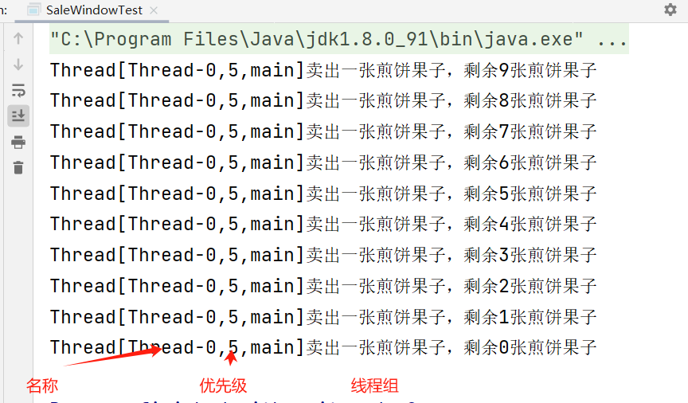
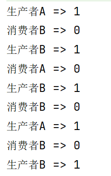
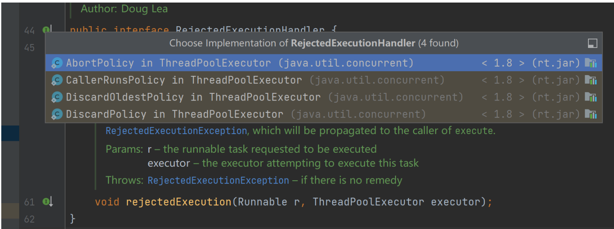

# 复习

## 多线程的创建方式

### 继承Thread类

```java
public class SonThread extends Thread{
	public void run(){
	操作多线程的代码；
	}
}
public class SonThreadTest{
	public static void main(String[] args){
	SonThread st = new SonThread();
	st.start();
	}
}
```

### 实现类Runnable接口

```java
public class SonRunnableImpl implements Thread{
	public void run(){
		操作多线程的代码;
	}
}

public class SonRunnableImplTest{
	public static void main(String[] args){
        Runnable r = new SonRunnableImpl();
        Thread t = new Thread(r);
    	t.start();
	}
}
```

### Thread类中的API

```java
// 无参构造器
public Thread();

// 有参构造器，主要用于与Runnable接口对象建立关联
public Thread(Runnable r);

// 有参构造器，主要用于与Callable接口对象建立关联
public Thread(Callable c);

// 获取当前线程对象，主要用于Runnable接口实现类中
public static Thread currentThread();

// 让当前线程睡眠指定毫秒数
public static void sleep(long millis);

// 编写多线程操作代码
public void run();

// 开启多线程操作，并调用重写的run方法
public void start();
```

## 多线程代码安全隐患问题

### 前提：

### 1、必须是多线程操作

### 2、多个线程必须操作共同资源

## 解决方式：

### 1、同步代码块

```java
public void run(){
	synchronized(类名.class){
		操作多线程的代码;
	}
}
```

### 2、同步函数

```java
public void run(){
	this.方法名();
}

public synchronized void 方法名(){
	操作多线程代码;
}
```

## 使用synchroniazd修饰符实现，会自动“上锁”和“解锁”


# 面试题

## 简述什么是并行和并发？

### 1、并发：单核操作，数据量较小的操作，按照顺序执行

### 2、并行：多核操作，数据量较大的操作，随机执行


## 简述多线程创建方式有哪些？如何开启多线程？不同方式的优缺点？实际开发中更推荐使用那种？

### 1、创建方式：继承Thread类、实现Runnable接口、实现Callable接口

### 2、通过Thread类对象调用start方法开启多线程

### 3、优缺点：

#### 		（1）继承：

#### 				优势：由于是继承关系，子类可以直接调用父类操作线程的方法

#### 				不足：由于是继承关系，一定成都导航提高类与类之间的耦合度

#### 		（1）实现：

#### 优势：一定程度上降低耦合度，避免Java中单继承局限性

#### 				不足：必须先与Thread类建立关联，调用比较麻烦


## 多线程的状态和不同状态下所具备的权限

| 状态     | 权限                       |
| -------- | -------------------------- |
| 创建状态 | 只有生存权                 |
| 运行状态 | 既有生存权，也有执行权     |
| 消亡状态 | 既没有生存权，也没有执行权 |
| 阻塞状态 | 只有生存权，没有执行权     |


## 创建状态和阻塞状态下的生存权的区别

### 创建状态多线程没有开启；阻塞状态多线程被开启，但是没有“抢到”CPU执行权

## 

## 处于阻塞状态下的线程存储的位置？进出原则？

### 处于阻塞状态下的线程在JVM提供的线程池中，遵循先进先出的原则


## 简述java中解决多线程代码安全隐患问题的方式有哪些？区别是什么？适用场景

### 	①方式：同步代码块 和 同步函数

### 	②区别：“锁”不同

### 		同步函数：只支持本类对象锁（即this关键字）

### 		同步代码块：任意对象锁（即Object对象）、本类对象锁（即this关键字）、反射机制锁（即类名.class）

### 	③适用场景：要根据用户的实际需求进行具体问题具体分析

### 		当业务逻辑较少时，推荐在run方法中直接定义同步代码块，不需要再次调用，“锁”的样式较多

### 		当业务逻辑较复杂时，推荐自定义同步函数，简化run方法中的业务逻辑，但是千万不要忘记在run方法中调用

# ====================

# 实现Callable接口创建多线程

## 为啥学这个？在传统继承Thread类或实现Runnable接口时都是对run方法的重写，由于run方法既不能传参，也不能有返回值；当许哦线程操作结果，在未来某一时刻使用时，run方法无法完成时，java提出Callable接口，针对没有返回值的，比如：现在的结果不想用，以后在用


# 拓展：

## JUC =>java.util.concurrent,这就是通常所有说的使用JUC方式解决多线程问题，将操作多线程的类定义在JUC包下


# 需求:使用Callable接口 和 FutureTask类创建线程，完成[1,100]的求和运算

```java
/*
* 创建类实现Callable接口
* */
public class MyCall implements Callable {

    @Override
    public Integer call() throws Exception {
        //一个实现了Callable<Integer>接口的匿名类的实例
        System.out.println("多线程计算[1,100]的和");
        int sum = 0;
        for (int i = 0; i < 101; i++) {
            sum += i;
        }
        return sum;
    }
}
```

```java
//测试类
public class MyCallTest {
    public static void main(String[] args) {
        //实例化Callable接口对象
        Callable<Integer> call = new MyCall();
        //实例化FutureTask类对象,将Callable接口对象作为参数传递
        FutureTask<Integer> task = new FutureTask<>(call);
        //创建Thread类，将FutureTask类对象作为参数传递，调用start方法
        Thread t = new Thread(task);
        t.start();
        /*
         * 由于多线程操作时定义在Callable接口实现类的call方法中
         * 需要通过FutureTask类对象调用方法，获取
         * public Object get();
         * */
        try {
            Integer sum = task.get();
            System.out.println("sum = " + sum);
        } catch (InterruptedException e) {
            e.printStackTrace();
        } catch (ExecutionException e) {
            e.printStackTrace();
        }
    }
}
```


## 总结：

### 1、创建类实现Callable接口，并重写call方法（等价实现Runnable接口，重写run方法），可以自定义返回值结果类型

### 2、实例化FutureTask类对象，并将Callable接口实现类对象作为参数传递，建立关联

### 3、创建实例化Thread类对象，并将FutureTask类对象作为参数传递，建立关联

### 4、用Thread类对象调用start方法开启多线程

### 5、通过FutureTask类对象调用get方法获取call方法操作结果

## 小结:三种创建多线程的方式对比，实现Callable接口和FutureTask类组合的方式最大的特点就是在重写call方法时可以自定义返回值类型，也可以抛出异常；在多线程操作完成后，可以在主线程中需要使用操作结果时，可以随时获取，其他两种方法就不行了！！！


# Lock锁接口

## 复习：synchroniazd修饰锁，无需创建直接使用保证线程安全，称之为隐式🔒，会自动“上锁” 和 释放🔒

## Lock锁接口：称之为显示🔒，需要调用者手动创建，并手动“上锁” 和 释放锁

```java
public class SaleWindow implements Runnable {
    private int eat = 10;
    //实例化Lock锁接口对象，手动创建一把🔒
    private Lock lock = new ReentrantLock();
    
    @Override
    public void run() {
        //假设10人排队买煎饼果子
        for (int i = 0; i < 11; i++) {
            //”上锁“ => public void lock();
            lock.lock();
            /*
            * 开锁的动作：无论是否买购买成功都要执行的操作，So
            * 需要定义在finally块中，而finall块中不能单独定义
            * 因此至少定义一个，try块预置配合使用
            * */
            try{
                if (eat > 0) {
                    eat--;
                    System.out.println(Thread.currentThread() + "卖出一张煎饼果子，剩余" + eat + "张煎饼果子");
                }
            }finally {
                //开锁 => public void unlock();
                lock.unlock();
            }
        }
    }
}
```

```java
public class SaleWindowTest {
    public static void main(String[] args) {
        Runnable r = new SaleWindow();
        Thread t0 = new Thread(r);
        Thread t1 = new Thread(r);
        Thread t2 = new Thread(r);
        t0.start();
        t1.start();
        t2.start();
    }
}
```




# Lock锁接口实现类ReentrantLock类详解

## 可重入互斥锁，是一个显式锁，具备synchroniazed修饰符相同作用，功能强大

## 互斥锁：当一个线程使用锁时，其他线程不能使用

## 可重入：意味着同一个线程可以多次获取这个🔒，不会因为之前拥有过而阻塞；这种机制可以防止”死“锁（🔒中🔒）的操作，可以提高代码的灵活性和安全性


# 企业级多线程编码规范

## 创建多线程的方法存在的问题：

### 1、继承Thread类:线程类，用于创建多线程，开启多线程执行

### 2、实现Runnable接口/实现Callable接口：只提供实现操作多线程的方法，需要和Thread 类建立关联，才能实现多线程的操作

### 3、以上3种创建多线程的方式都是共同资源定义在多线程实现类中，责任不明确，企业开发会将资源单独封装（达到责任分离~）

```java
/*
 * 资源类封装
 * */
public class Ticket {
    //私有变量count用于表示煎饼果子的数量，初始值为8
    private int count = 8;
    //🔒的是资源，卫生间都在里面锁的，操作完之后才释放
    //实例化Lock接口对象,用于实现线程同步控制。
    private Lock lock = new ReentrantLock();

    //自定义卖果子的方法
    public void saleTick() {
        //关锁 - 调用lock.lock()来获取锁
        /*
         *确保在同一时刻只有一个线程可以执行该方法内的代码块
         * */
        lock.lock();
        try {
            if (count > 0) {
                //然后，检查count是否大于0
                count--;
                System.out.println(Thread.currentThread().getName() + "::卖出一张煎饼果子，剩余" + count + "张煎饼果子");
                //并输出当前线程名和剩余的煎饼果子数量。
            }
        } finally {
            //开锁 - 在finally代码块中释放锁，即调用lock.unlock()。
            lock.unlock();
        }
    }
}
         /*
          * 这个类的主要作用是模拟煎饼果子的销售过程，通过加锁
          * 和解锁来保证多个线程访问共享资源时的线程安全。
          * */
```

```java
/*
 * 创建类实现多线程操作
 * */
public class SaleTickWindow implements Runnable {
//一个名为SaleTickWindow的类，它实现了Runnable接口。这意味着它可以被用作一个线程来执行任务。

    private Ticket ticket;
    //一个私有成员变量ticket，它是Ticket类型的对象。
    //这个对象是通过构造函数注入的，表示该窗口依赖一个Ticket对象来进行煎饼果子的销售操作。

    public SaleTickWindow(Ticket ticket) {
        //创建SaleTickWindow对象时，接收一个Ticket类型的
        //参数，并将其赋值给类的成员变量ticket。
        this.ticket = ticket;
    }

    @Override
    public void run() {
        /*
         * run()方法是Runnable接口必须实现的方法，
         * 它定义了线程执行的任务。在这个例子中，
         * run()方法通过循环调用ticket.saleTick()方法11次，
         * 模拟了窗口卖出煎饼果子的过程。每次调用saleTick()方法时，
         * 都会尝试减少煎饼果子的数量，并输出当前线程名和剩余数量
         * */
        for (int i = 0; i < 11; i++) {
            ticket.saleTick();
        }
    }
}
```

```java
/*
* 测试类
* */
public class SaleTickWindowTest {
    public static void main(String[] args) {
        Runnable r = new SaleTickWindow(new Ticket());
        //首先创建了一个Runnable对象r，并将一个新的Ticket对象传递给SaleTickWindow构造函数
        Thread t0 = new Thread(r);
        Thread t1 = new Thread(r);
        Thread t2 = new Thread(r);
        //创建了三个线程t0、t1和t2，每个线程都使用相同的Runnable对象r作为其任务。
        t0.start();
        t1.start();
        t2.start();
        //调用每个线程对象的start()方法来启动这些线程。
        //这将导致它们并发地执行run()方法中的代码，
        //即SaleTickWindow类的run()方法。
    }
}
```

## 步骤总结：

### 1、创建资源类，根据参考javaBean定义规范，定义资源类；还要创建Lock🔒接口和自定义处理资源的方法（等效于之前定义过的同步函数）

### 2、创建类实现多线程的操作，在该类中依赖注入资源类，在重写的多线程的操作方法中，通过资源类对象调用操作资源的方法

### 3、创建测试类，在测试类中开启多线程的操作

## ***会使用Lock锁接口解决多线程代码安全隐患问题***


# 线程间的通讯！！！！！！！！！！！

## 多个线程之间进行协同工作，操作的是共同的资源

## question : 多个线程在”抢占“CPU的执行权，保证多个线程执行的先后顺序

## 常见案例 ：生产消费者模型（两个线程，一个生产，一个消费，操作的是同一个资源，要有执行的先后顺序和代码安全问题）

## want : 创建两个线程，实现对一个初始值为0的变量进行+1(生产者)和-1（消费者）交替操作

#### *<u>分析：</u>*

#### *<u>假设生产者获取执行权，直接执行；</u>*

#### *<u>消费者获取执行权，需要等待，唤醒生产者进行生产，生产结束后；</u>*

#### *<u>唤醒消费者消费  ——  无论是生产者还是消费者，都需要等待唤醒，等待是让自己等待，唤醒是唤醒线程池中的所有线程</u>*


# 用传统方式synchronized+wait+notifyAll组合实现生产消费者模型问题

```java
/*
 * Data共同资源
 * */
public class Data {
    private int num = 0;
    //共享资源是一个整数变量num，初始值为0

    //add()方法模拟生产者的行为
    public synchronized void add() {
        try {//判断共同资源是否有值
            if (num != 0) {
                //生产者等待-调用wait()方法
                this.wait();
            }
            /*
             * 直到消费者消费了资源（即num变为0）。
             * 一旦num为0，生产者线程将设置其名称为"生产者"
             * */
            //设置当前线程名称为生产者-进行共同资源的生产
            Thread.currentThread().setName("生产者");
            num++;
            //增加num的值并打印出来，然后通过调用notify()方法
            System.out.println(Thread.currentThread().getName() + " => " + num);
            //唤醒线程池中的所有线程 - 唤醒其他等待的线程。
            this.notifyAll();
        } catch (InterruptedException e) {
            e.printStackTrace();
        }
    }

    //消费者
    public synchronized void subtract() {
        try {//判断共同资源是否有值
            if (num == 0) {//当num不为0时
                //消费者等待
                this.wait();
                //直到生产者生产了新的资源（即num变为非零值）
            }
            //设置当前线程名称为消费者 — 一旦num不为0，消费者线程将设置其名称为"消费者"
            Thread.currentThread().setName("消费者");
            //进行共同资源的消费 — 减少num的值并打印出来
            num--;
            System.out.println(Thread.currentThread().getName() + " => " + num);
            //唤醒线程池中的所有线程-然后通过调用notify()方法唤醒其他等待的线程。
            this.notifyAll();
        } catch (InterruptedException e) {
            e.printStackTrace();
        }
    }
}
/*
 * 这个简单的生产者消费者模型可以用于演示多线程编程中的同步和互斥概念，
 * 以及如何使用wait()和notify()方法来实现线程间的协作。
 * */
```

```java
/*
* 简单的生产者消费者模型，其中有两个线程t0和t1。
* 线程t0负责生产数据，通过调用data对象的add()方法；
* 线程t1负责消费数据，通过调用data对象的subtract()方法。
* 这两个线程分别执行11次操作，总共进行22次操作。
* */
public class SynchronizedWaitNotifyAllTest {
    public static void main(String[] args) {
        Data data = new Data();
        //生产者
        Thread t0 = new Thread(new Runnable() {
            @Override
            public void run() {
                for (int i = 0; i < 11; i++) {
                    data.add();
                }
            }
        });
        //消费者
        Thread t1 = new Thread(new Runnable() {
            @Override
            public void run() {
                for (int i = 0; i < 11; i++) {
                    data.subtract();
                }
            }
        });
        t0.start();
        t1.start();
    }
}
```


# 面试题：

## 简述Sleep方法和wait方法的异同点：

#### 相同点:当线程执行到sleep方法或wait方法时，都不会继续向后执行，由运行状态转为阻塞状态，进入到线程池中存储

#### 不同点:sleep方法:到时自动醒来，但是不会释放锁对象wait方法:需要配合指定方法进行手动唤醒，但是会释放锁对象


# 假醒问题：

## 需求升级：再次创建一个生产者和消费者

### 	①注释掉资源类中设置线程名的操作

### 	②测试类中再次创建一个生产者和消费者

```java
/*
 * Data共同资源
 * */
public class Data {
    private int num = 0;
    //共享资源是一个整数变量num，初始值为0

    //add()方法模拟生产者的行为
    public synchronized void add() {
        try {//判断共同资源是否有值
            if (num != 0) {
                //生产者等待-调用wait()方法
                this.wait();
            }
            /*
             * 直到消费者消费了资源（即num变为0）。
             * 一旦num为0，生产者线程将设置其名称为"生产者"
             * */
            //设置当前线程名称为生产者-进行共同资源的生产
            //Thread.currentThread().setName("生产者");
            num++;
            //增加num的值并打印出来，然后通过调用notify()方法
            System.out.println(Thread.currentThread().getName() + " => " + num);
            //唤醒线程池中的所有线程 - 唤醒其他等待的线程。
            this.notifyAll();
        } catch (InterruptedException e) {
            e.printStackTrace();
        }
    }

    //消费者
    public synchronized void subtract() {
        try {//判断共同资源是否有值
            if (num == 0) {//当num不为0时
                //消费者等待
                this.wait();
                //直到生产者生产了新的资源（即num变为非零值）
            }
            //设置当前线程名称为消费者 — 一旦num不为0，消费者线程将设置其名称为"消费者"
            //Thread.currentThread().setName("消费者");
            //进行共同资源的消费 — 减少num的值并打印出来
            num--;
            System.out.println(Thread.currentThread().getName() + " => " + num);
            //唤醒线程池中的所有线程-然后通过调用notify()方法唤醒其他等待的线程。
            this.notifyAll();
        } catch (InterruptedException e) {
            e.printStackTrace();
        }
    }
}
/*
 * 这个简单的生产者消费者模型可以用于演示多线程编程中的同步和互斥概念，
 * 以及如何使用wait()和notify()方法来实现线程间的协作。
 * */
```

```java
public class SynchronizedWaitNotifyAllTest {
    public static void main(String[] args) {
        Data data = new Data();
        //生产者
        Thread t0 = new Thread(new Runnable() {
            @Override
            public void run() {
                for (int i = 1; i < 11; i++) {
                    data.add();
                }
            }
        },"生产者A");//👈
        //消费者
        Thread t1 = new Thread(new Runnable() {
            @Override
            public void run() {
                for (int i = 1; i < 11; i++) {
                    data.subtract();
                }
            }
        },"消费者A");//👈
        //生产者
        Thread t2 = new Thread(new Runnable() {
            @Override
            public void run() {
                for (int i = 1; i < 11; i++) {
                    data.add();
                }
            }
        },"生产者B");//👈
        //消费者
        Thread t3 = new Thread(new Runnable() {
            @Override
            public void run() {
                for (int i = 1; i < 11; i++) {
                    data.subtract();
                }
            }
        },"消费者B");//👈
        t0.start();
        t1.start();
        t2.start();
        t3.start();
    }
}
```



### 结果分析:无论是生产者还是消费者，都是通过notifyAll方法进行唤醒这个方法将会唤醒处于阻塞状态下的所有线程;由于之前的线程进入到阻塞状态是从wait方法开始，因此再次被唤醒后，不需要判断值，直接向后继续执行，因此出现错误结果

### 解决办法:当被唤醒后，需要再次判断，使用循环;由于不知道判断多少次，因此推荐使用while循环

```java
/*
 * Data共同资源
 * */
public class Data {
    private int num = 0;
    //共享资源是一个整数变量num，初始值为0

    //add()方法模拟生产者的行为
    public synchronized void add() {
        try {//判断共同资源是否有值
            while (num != 0) {
                //生产者等待-调用wait()方法
                this.wait();
            }
            /*
             * 直到消费者消费了资源（即num变为0）。
             * 一旦num为0，生产者线程将设置其名称为"生产者"
             * */
            //设置当前线程名称为生产者-进行共同资源的生产
            //Thread.currentThread().setName("生产者");
            num++;
            //增加num的值并打印出来，然后通过调用notify()方法
            System.out.println(Thread.currentThread().getName() + " => " + num);
            //唤醒线程池中的所有线程 - 唤醒其他等待的线程。
            this.notifyAll();
        } catch (InterruptedException e) {
            e.printStackTrace();
        }
    }

    //消费者
    public synchronized void subtract() {
        try {//判断共同资源是否有值
            while (num == 0) {//当num不为0时
                //消费者等待
                this.wait();
                //直到生产者生产了新的资源（即num变为非零值）
            }
            //设置当前线程名称为消费者 — 一旦num不为0，消费者线程将设置其名称为"消费者"
            //Thread.currentThread().setName("消费者");
            //进行共同资源的消费 — 减少num的值并打印出来
            num--;
            System.out.println(Thread.currentThread().getName() + " => " + num);
            //唤醒线程池中的所有线程-然后通过调用notify()方法唤醒其他等待的线程。
            this.notifyAll();
        } catch (InterruptedException e) {
            e.printStackTrace();
        }
    }
}
```


# 使用JUC方式编写生产消费者模型

## 原因：传统方式需要while循环，来避免假醒问题执行效率低

## 技术栈 :  Lock锁接口(平替synchronized同步)+await方法(平替wait方法)+signalAll(平替notifyAll方法)

## Condition接口：提供满足某种条件或发生变化时，线程可以等待或唤醒操作，通常Condition接口和ReentrantLock类组合使用，实现更复杂的线程同步通讯操作

```java
//资源类
public class DataByJUC {
    private int num = 0;
    private Lock lock = new ReentrantLock();

    //为线程提供等待或唤醒的操作
    private Condition condition = lock.newCondition();

    //生产者
    public void add() {
        lock.lock();
        try {
            while (num == 1) {
                condition.await();//等待
            }
            num++;
            System.out.println(Thread.currentThread().getName() + " => " + num);
            condition.signalAll();
        } catch (InterruptedException e) {
            e.printStackTrace();
        } finally {
            lock.unlock();
        }
    }
    //消费者
    public void subtract() {
        lock.lock();
        try {
            while (num == 0) {
                condition.await();//等待
            }
            num--;
            System.out.println(Thread.currentThread().getName() + " => " + num);
            condition.signalAll();
        } catch (InterruptedException e) {
            e.printStackTrace();
        } finally {
            lock.unlock();
        }
    }
}
```

```java
//测试类
public class JUCTest {
    public static void main(String[] args) {
        DataByJUC data = new DataByJUC();
        //生产者
        Thread t0 = new Thread(new Runnable() {
            @Override
            public void run() {
                for (int i = 1; i < 11; i++) {
                    data.add();
                }
            }
        }, "生产者A");//👈
        //消费者
        Thread t1 = new Thread(new Runnable() {
            @Override
            public void run() {
                for (int i = 1; i < 11; i++) {
                    data.subtract();
                }
            }
        }, "消费者A");//👈
        //生产者
        Thread t2 = new Thread(new Runnable() {
            @Override
            public void run() {
                for (int i = 1; i < 11; i++) {
                    data.add();
                }
            }
        }, "生产者B");//👈
        //消费者
        Thread t3 = new Thread(new Runnable() {
            @Override
            public void run() {
                for (int i = 1; i < 11; i++) {
                    data.subtract();
                }
            }
        }, "消费者B");//👈
        t0.start();
        t1.start();
        t2.start();
        t3.start();
    }
}
```


# 线程池创建方式（4种，掌握前3种）

## 目前手动创建线程存在的问题：

## 1、创建线程和销毁线程需要硬件执行，消耗时间

## 2、线程的创建 和 销毁容易引起内存抖动，触发GC（垃圾回收处理机制）容易造成卡顿


## 解决办法——“池”技术：

### 使用的是线程池（Thread Pool）技术，所谓线程池是一种多线程使用模式，降低多个线程创建 和 销毁过程中带来的调度开销，从而提高性能；线程池中可以同时存储多个线程对象，等待这调用者分配任务，可以避免在处理短时间任务时创建 和 销毁代价，不仅能够保证内核充分利用，还能防止过分调用


## 应用核心

### 1、四大方法——创建线程池

### 2、七大参数——配置线程池

### 3、四大拒绝策略——防止过度调用


# 创建方式：都是由JUC包下提供Executors工具类提供的方法创建

## 方式一：

```java
public class CreateThreadPoolTest1 {
    public static void main(String[] args) {
        /*
         * 方式一：
         *   newFixedThreadPool(int nThreads)
         *   一池N个线池，参数表示线程对象的初始个数
         * */
        ExecutorService pool = Executors.newFixedThreadPool(4);
        for (int i = 0; i < 11; i++) {
            int TaskNo = 1;
            pool.execute(new Runnable() {
                @Override
                public void run() {
                    System.out.println(Thread.currentThread().getName() + "=>" + TaskNo);
                }
            });
        }
        //销毁线程池
        pool.shutdown();
    }
}
```

## 方式二：

```java
public class CreateThreadPoolTest2 {
    public static void main(String[] args) {
        /*
         * 方式二：
         *   newCachedThreadPool()
         *   可伸缩线程池，上限21亿，根据电脑的具体性能使用
         * */
        ExecutorService pool = Executors.newCachedThreadPool();
        for (int i = 0; i < 11; i++) {
            int TaskNo = 1;
            pool.execute(new Runnable() {
                @Override
                public void run() {
                    System.out.println(Thread.currentThread().getName() + "=>" + TaskNo);
                }
            });
        }
        //销毁线程池
        pool.shutdown();
    }
}
```

## 方式三：

```java
public class CreateThreadPoolTest3 {
    public static void main(String[] args) {
        /*
         * 方式三：
         *   newSingleThreadExecutor()
         *   按照顺序执行，排队处理
         * */
        ExecutorService pool = Executors.newSingleThreadExecutor();
        for (int i = 0; i < 11; i++) {
            int TaskNo = 1;
            pool.execute(new Runnable() {
                @Override
                public void run() {
                    System.out.println(Thread.currentThread().getName() + "=>" + TaskNo);
                }
            });
        }
        //销毁线程池
        pool.shutdown();
    }
}
```

## 方式四：Excutors.newScheduledThreadPool()（了解知道即可）


# 线程池创建步骤：

## 1、通过Excutors类名调用方法创建线程池

## 2、在线程池中分配多线程人物

## 3、一定销毁线程池


# 线程池7大参数+4大常见策略模式

# 线程池7大参数

```java
public ThreadPoolExecutor(int corePoolSize,
                          int maximumPoolSize,
                          long keepAliveTime,
                          TimeUnit unit,
                          BlockingQueue<Runnable> workQueue,
                          ThreadFactory threadFactory,
                          RejectedExecutionHandler handler)
```

### 1、int corePoolSize:核心线程池中一直活着的对象，当需要哦多线程操作时，也是最先被调用的，即初始化线程对象个数

### 2、int maximumPoolSize:最大线程数，表示当前线程池中可以存活线程对象的最大个数；当核心线程数全部被占用时，线程池会自动创建新的线程，但是不会超过最大线程数

### 3、long keepAliveTime: 线程空闲时间，非核心线程等待任务时间

### 4、TimeUtil unit:设置等待时间的单位（million毫秒）

### 5、BlockingQueue<Runnable>workQueue:消息队列，用于存储等待执行的任务

### 6、ThreadFactory threadFactory :  线程工厂，用于批量创建线程对象

### 7、RejectedExecutionHandler handle : 拒绝策略，防止过度调用

# 4大常见策略模式——四大拒绝策略

## (理解)--策略模式(是Java中23种常见设计模式的一种)



### 1、(默认的拒绝策略):抛出异常阻止程序运行，实际开发中使用该策略即可

### 2、CallerRunsPolicy:"调用者运行“机制，不抛异常，也不会抛弃任务，将任务退后调用者

### 3、DiscardoldestPolicy:抛弃消息队列中等待最久的任务

### 4、DiscardPolicy:抛弃消息队列中所有的任务


# 手动创建连接池

```java
public class DIYThreadPoolTest {
    public static void main(String[] args) {
        //创建线程池对象
        ThreadPoolExecutor pool = new ThreadPoolExecutor(
                3,
                4,
                30,
                TimeUnit.SECONDS,
                new LinkedBlockingDeque<>(),
                new ThreadPoolExecutor.AbortPolicy()
        );
        //给线程池中的线池分配任务
        for (int i = 0; i < 10; i++) {
            int num = 0;
            pool.execute(new Runnable() {
                @Override
                public void run() {
                    System.out.println(Thread.currentThread().getName() + "::" + num);
                }
            });
        }
        //销毁线程池
        pool.shutdown();
    }
}
/*
* 创建了一个DIYThreadPoolTest类，其中包含一个main方法。在main方法中，首先创建了一个线程池对象pool，该线程池的核心线程数为3，最大线程数为4，空闲线程存活时间为30秒，任务队列使用LinkedBlockingDeque，拒绝策略为AbortPolicy。

然后，通过for循环向线程池提交10个任务，每个任务都是一个Runnable对象，其run方法打印当前线程的名称和变量num的值。由于num在每次循环中都被初始化为0，所以所有任务打印的内容都是一样的。

最后，调用pool.shutdown()方法销毁线程池。
* */
```


# 员工管理系统


